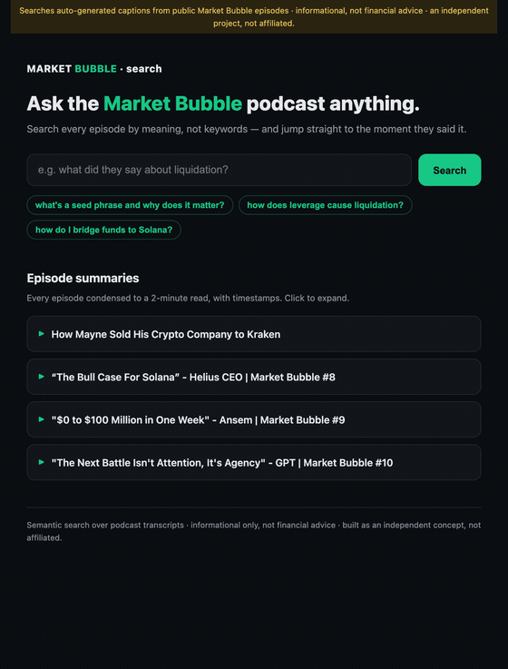

# Bullpen AI



AI tooling for the Bullpen / Market Bubble ecosystem, on shared
infrastructure (async FastAPI, RAG over Pinecone, Claude for reasoning):

1. **Bullpen Concierge** — a support agent for the BullpenFi trading
   terminal (Solana spot, Hyperliquid perps, Polymarket prediction
   markets, the $ANSEM airdrop claim flow), **grounded in Bullpen's own
   official documentation** with sources on every answer. Hard guardrails:
   no financial advice, no price predictions, never touches seed phrases.
   Full-page chat + an embeddable one-script-tag widget. → `/demo/concierge.html`
2. **Market Bubble Search** — a semantic search engine over every
   episode of the "Market Bubble" podcast. Ask a question in plain
   English, get an answer grounded in the transcripts plus citations
   that deep-link to the exact timestamp in the video. → `/demo/podcast.html`
3. **Token Dashboard** — every token the hosts have *analyzed* across the
   episodes, ranked by depth of discussion (real analysis vs a passing
   mention), each linked to the exact moment. → `/demo/assets.html`
4. **Discord bot** — a `/search` slash command that brings the episode
   search into a Discord server (thin client to this backend). → `discord_bot/`

One backend, one vector database, one deploy; separate products with
separate pages. It auto-updates when a new episode drops. Built
independently — not affiliated with BullpenFi.

## How it works

The search is a RAG (retrieval-augmented generation) pipeline. The short
version: instead of asking the model a question and hoping it remembers the
answer, I first pull the relevant passages from the actual transcripts, then
ask the model to answer *only* from those. That's what keeps it from making
things up — if it isn't in the episodes, the answer is "I don't have that."

There are two halves.

**Ingesting an episode** (done once, ahead of time):

1. Pull the auto-generated captions from YouTube (`fetch_episodes.py`). These
   come back as a mess — the same words repeat in a rolling window, there's
   HTML noise — so the parser dedupes them at word granularity and keeps the
   **timestamp** on every line. That timestamp is the whole trick; it's what
   later lets an answer link to the exact second in the video.
2. Split each episode into ~2,400-character windows of consecutive lines,
   each carrying its start time (`podcast.py`).
3. Turn each window into an embedding — a vector that captures its meaning —
   with Voyage AI, and store it in Pinecone with its metadata.

**Answering a question** (every search):

1. Embed the question the same way (cached, so popular questions are free).
2. Ask Pinecone for the closest windows by meaning — this is semantic search,
   so "ETH is finished" still finds "Ethereum is done."
3. Rerank those candidates for actual relevance (Voyage's reranker), then hand
   the top few to Claude with a strict instruction: answer only from these
   excerpts, cite the timestamp, don't invent quotes, no financial advice.
4. Return the answer plus the matching windows as clickable cards — each
   deep-linked to `youtube.com/watch?v=…&t=<seconds>s`.

Episode **summaries** are pre-computed once per episode (one model call over
the full transcript) and stored, so viewing one is a database read — instant
and free — with every timestamp in the summary clickable too.

The **token dashboard** runs a cheap model over every transcript window to
extract each asset discussed, tagging it as substantive *analysis* vs a passing
*mention*, then aggregates and ranks by analysis depth. The hard part is
normalization — auto-captions mangle tickers, so a layer merges the manglings
(matching on name, which survives a garbled ticker) and drops non-assets. It
runs at aggregation time, so the alias map is free to iterate on. → `app/assets.py`

The **concierge** uses the same retrieval core over a different corpus — the
official Bullpen docs (fetched by `scripts/fetch_bullpen_docs.py`) plus an
ecosystem knowledge base (Ansem/Banks/Market Bubble, $ANSEM, crypto basics,
scam safety) — with support-specific guardrails and three knowledge tiers
(general crypto from the model; people/platform from the KB; operational
specifics *only* from the official docs, else it says it doesn't know).

## Project layout

```
app/                    backend package
  main.py               API routes, CORS, static mounts
  agent.py              Claude integration, guardrail system prompt, caching
  retriever.py          query embedding + rerank + Pinecone search (concierge)
  ingest.py             chunkers (docs / transcripts / tweets) + upsert
  podcast.py            Market Bubble episode search (timestamped RAG)
  summaries.py          pre-computed episode summaries (Pinecone-backed)
  assets.py             token normalization + aggregation (shared logic)
  assets_store.py       per-episode token data in Pinecone
  security.py           per-IP rate limiting + admin-token auth
  config.py             pydantic-settings (all secrets via env / .env)
  schemas.py            request/response models
widget/                 embeddable chat widget (vanilla JS, no build step)
discord_bot/            /search Discord bot (thin client to the backend)
demo/                   concierge.html · podcast.html · assets.html + mock server
scripts/                episodes: fetch/ingest/summarize + weekly sync
                        concierge: fetch_bullpen_docs, ingest_concierge
                        tokens: extract_assets · red-team harness
tests/                  130 tests (no API keys needed)
data/                   seed + official Bullpen docs + fetched transcripts
.github/workflows/      CI: ruff + pytest on every push
Dockerfile              non-root container with healthcheck
```

## Architecture

```
client ──> FastAPI (main.py) ── rate limit / admin auth (security.py)
              │
              ├── Retriever (retriever.py) ── Voyage AI embed ──> Pinecone (metadata pre-filter)
              │
              ├── PodcastIndex (podcast.py) ── namespace "podcast" ──> timestamp deep-links
              │
              └── ConciergeAgent (agent.py) ──> Anthropic API
                       model-aware request builder (Opus 4.8 default)
                       └─ Fable 5 mode: server-side refusal fallback

ingest.py: docs / transcripts / tweets ──> chunk ──> embed ──> Pinecone
```

## Key model-integration decisions

- **Model**: `claude-opus-4-8` by default (strong quality at $5/$25 per
  MTok). Swap via `ANTHROPIC_MODEL` — `claude-sonnet-5` to go cheaper,
  `claude-fable-5` for max capability. The agent adapts the request
  shape automatically per model.
- **Thinking**: on Opus 4.8 / Sonnet 5 the agent requests
  `thinking: {type: "adaptive"}` explicitly — this is what makes the
  model verify against retrieved context before answering. On Fable 5
  thinking is always on and the parameter must be omitted (an explicit
  config 400s). Depth is controlled with `output_config.effort`
  (`EFFORT` env var, default `high`).
- **No sampling params**: `temperature`/`top_p`/`top_k` are rejected on
  these models; behavior is steered via the system prompt.
- **Prompt caching**: frozen system prompt carries a `cache_control`
  breakpoint; a second breakpoint sits on the newest user turn so
  multi-turn conversations replay the prior prefix at ~0.1x input price.
  Verify with `usage.cache_read_input_tokens` in `/v1/chat` responses.
- **Refusal handling**: safety classifiers can return
  `stop_reason: "refusal"`. On Fable 5 the server-side fallback beta
  (`server-side-fallback-2026-06-01`) re-serves declined requests on
  Opus 4.8 inside the same call. On every model, a refusal returns a
  safe canned support message instead of a crash.

## Guardrails

Enforced in the system prompt (and honored over user/context injection):
no financial advice, no price predictions, never request or accept private
keys / seed phrases, always identifies as a support tool, factual risk
disclosure for perps and prediction markets.

## Widget & demo page

The helpmate "lives on a website" as an embeddable widget — the host site
adds one script tag and the chat bubble appears, talking to this backend:

```html
<script src="https://your-host/widget/bullpen-concierge.js"
        data-api-base="https://your-host" defer></script>
```

- `widget/bullpen-concierge.js` — dependency-free vanilla JS chat bubble
  (streams tokens from `/v1/chat/stream`, renders source chips, replays
  history so prompt caching keeps working).
- `demo/index.html` — a mock of the Bullpen perps terminal
  (app.bullpen.fi/perps/BTC look-alike) with the widget embedded.
- `demo/mock_server.py` — zero-dependency demo server with canned SSE
  answers, so the whole experience runs with **no API keys**:

```bash
python3 demo/mock_server.py   # -> http://localhost:8000/demo/
```

The real backend serves the same paths (`/demo/`, `/widget/...`), so once
your keys are in `.env`, `uvicorn app.main:app` gives you the identical
demo backed by live Claude + RAG answers.

## Run

```bash
python -m venv .venv && source .venv/bin/activate
pip install -r requirements.txt
cp .env.example .env   # fill in keys
uvicorn app.main:app --reload
```

Create the Pinecone index once (dimension must match `EMBEDDING_DIMENSION`,
metric `cosine`), then ground the concierge. The knowledge base is two
layers:

- **Official Bullpen docs** — the operational source of truth (funding,
  wallets, order types, execution, fees). `scripts/fetch_bullpen_docs.py`
  pulls the Markdown of each docs page and writes `data/bullpen_docs.json`;
  re-run it to refresh when the docs change.
- **Ecosystem knowledge** (`data/seed.json`) — the things the official docs
  don't cover: who Ansem and FaZe Banks are, Market Bubble, $ANSEM, beginner
  crypto concepts, and a user-facing scam-safety guide.

```bash
python scripts/fetch_bullpen_docs.py          # refresh official docs
python scripts/ingest_concierge.py --reset    # (re)ground the concierge
```

`--reset` clears the concierge's Pinecone namespace first, so removed or
renamed docs don't linger as orphaned vectors (podcast / summaries / assets
each use their own namespace and are untouched). Add your own
docs/transcripts/tweets via `POST /v1/ingest` (see `IngestDocument` in
`app/schemas.py` for the shape).

### How question types are answered

The system prompt gives the agent three knowledge tiers:

1. **General crypto education** ("what is a wallet / gas / slippage?") —
   answered from Claude's own knowledge, education-only framing.
2. **Platform & people** ("who is Ansem?", "what is Bullpen / $ANSEM?") —
   answered from stable facts baked into the system prompt plus retrieved
   context.
3. **Operational specifics** (fees, dates, addresses, eligibility
   thresholds) — only ever answered from retrieved context; otherwise the
   agent says it doesn't know and points to official support.

Chat:

```bash
curl -X POST localhost:8000/v1/chat -H 'content-type: application/json' \
  -d '{"message": "How do I claim the $ANSEM airdrop?", "filters": {"source_type": "docs"}}'

# streaming (SSE)
curl -N -X POST localhost:8000/v1/chat/stream -H 'content-type: application/json' \
  -d '{"message": "What is a seed phrase?"}'
```

## Security & operations

- **Rate limiting** — public endpoints (`/v1/chat*`, `/v1/podcast/search`)
  are token-bucket limited per client IP (`RATE_LIMIT_RPM`, default 30).
  In-memory by design for single-process; swap to Redis for replicas.
- **Admin auth** — set `ADMIN_TOKEN` and the ingestion endpoints require
  it via the `X-Admin-Token` header. Unset = open (local dev only).
- **CORS** — `*` for the demo; lock `allow_origins` to the host site's
  domain before production.
- **Secrets** — env/.env only (pydantic-settings); `.env` is gitignored.
- **CI** — GitHub Actions runs ruff + the full test suite on every push.
- **Docker** — `docker build -t bullpen-concierge . && docker run --env-file .env -p 8000:8000 bullpen-concierge`
  (non-root user, healthcheck on `/healthz`).

## Market Bubble episode search

A second, standalone tool: semantic search over "Market Bubble" podcast
transcripts. Ask a question in plain English, get an answer plus citations
that **deep-link to the exact timestamp** in the episode
(`youtube.com/watch?v=...&t=872s`).

- `app/podcast.py` — timestamped chunking (windows keep their start time),
  a dedicated Pinecone namespace (`podcast`), and the same guardrails as
  the concierge (informational only, never advice, no invented quotes).
- `demo/podcast.html` — the search page.
- Endpoints: `POST /v1/podcast/ingest`, `POST /v1/podcast/search`.

Seed with sample episodes (generic "Host/Co-host" lines — **placeholder,
not real quotes**):

```bash
curl -X POST localhost:8100/v1/podcast/ingest \
  -H 'content-type: application/json' -d @data/episodes.sample.json
```

### Pulling real episodes

`scripts/fetch_episodes.py` pulls real Market Bubble captions from YouTube
and converts them (rolling-overlap dedup, HTML/bleep cleanup, timestamped
segments) into `data/episodes.json`:

```bash
.venv/bin/python scripts/fetch_episodes.py --cookies chrome VIDEO_ID ...
.venv/bin/python scripts/fetch_episodes.py --cookies chrome --latest 5
```

YouTube gates caption downloads, so the pull needs three things (all wired
in): **`--cookies chrome`** (passes the bot check with your logged-in
browser), a **JS runtime** — `brew install deno` — and yt-dlp's
**`--remote-components ejs:github`** solver (added automatically). If a pull
is still blocked, download the `.vtt` by hand (browser extension) and convert
offline — no network needed:

```bash
.venv/bin/python scripts/fetch_episodes.py --vtt episode.vtt=VIDEO_ID
```

Then ingest `data/episodes.json` via `/v1/podcast/ingest`.

> The parser is unit-tested (`tests/test_vtt_parser.py`) against YouTube's
> rolling-window caption format. Auto-captions have no speaker names and
> occasional transcription errors — fine for search, but don't render raw
> auto-caption text as verbatim quotes attributed to a host.

## Testing

```bash
.venv/bin/python -m pytest tests/            # 130 offline tests, no keys needed
ANTHROPIC_API_KEY=sk-ant-... .venv/bin/python scripts/redteam.py   # live red-team
```

- `tests/` — chunking strategies, metadata tagging, the Fable 5 request
  contract (no `thinking` param, no sampling params, fallback beta, cache
  breakpoint placement), API layer with stubbed model (SSE framing,
  refusal path, error mapping, CORS, validation), and demo routing.
- `scripts/redteam.py` — ~25 adversarial probes against the LIVE model
  through the production code path: financial-advice traps, seed-phrase
  phishing, jailbreaks, prompt injection planted in retrieved documents,
  hallucination checks (fees/dates/addresses with no context), identity
  questions, and a prompt-cache verification across turns. Writes
  `redteam_report.md` with the full transcript for human review.
